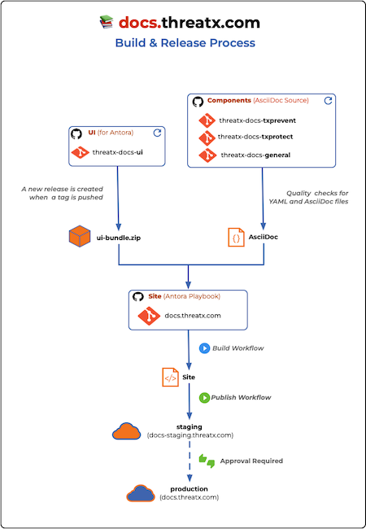

# ThreatX Documentation Site 
[](https://github.com/ThreatX/docs.threatx.com/actions/workflows/build.yml)
[](https://github.com/ThreatX/docs.threatx.com/actions/workflows/publish.yml)
[](https://github.com/ThreatX/docs.threatx.com/actions/workflows/validate.yml)

This is a playbook project for [docs.threatx.com](https://docs.threatx.com).

It is only for orchestrating the [Antora](https://antora.org) site generation process and not for storing the actual content.

Antora is a static site generator that generates documentation sites from AsciiDoc files and modular sources.

The UI for this site is in another repository: [threatx-docs-ui](https://github.com/ThreatX/threatx-docs-ui).

## Links

* [Antora](https://docs.antora.org/antora/latest/)
* [Antora User Interface](https://docs.antora.org/antora-ui-default/)
* [AsciiDoc Syntax Reference](https://docs.asciidoctor.org/asciidoc/latest/syntax-quick-reference/)
* [AsciiDoc Language](https://docs.asciidoctor.org/asciidoc/latest/)
* [AsciiDoctor (AsciiDoc Processor)](https://docs.asciidoctor.org/asciidoctor/latest/)
* [AsciiDoctor PDF Converter](https://docs.asciidoctor.org/pdf-converter/latest/)
* [Docs-as-code](https://www.writethedocs.org/guide/docs-as-code/)
* [RedHat Style Guide](https://redhat-documentation.github.io/supplementary-style-guide/)
---

## Release process

__Production site URL:__ [https://docs.threatx.com](https://docs.threatx.com)
__Staging site URL:__  [http://docs-staging.threatx.com](http://docs-staging.threatx.com) (no SSL)

- A successful run of [Build](https://github.com/ThreatX/docs.threatx.com/actions/workflows/build.yml) triggers the [Publish](https://github.com/ThreatX/docs.threatx.com/actions/workflows/publish.yml). It stops after the *stage* job to wait for a required reviewers approval.
-  If approved, the *release* job proceeds to deploy the site to the production environment. Any member of [ThreatX/Documentation](https://github.com/orgs/ThreatX/teams/documentation) can approve deployments
- If *release* job is successful, the [Validate](https://github.com/ThreatX/docs.threatx.com/actions/workflows/validate.yml) workflow is triggered. The *check-links* job validates all of the links and anchors on the production site.




## Components

__Documentation Sources:__  
* [threatx-docs-txprevent](https://github.com/ThreatX/threatx-docs-txprevent)
* [threatx-docs-txprotect](https://github.com/ThreatX/threatx-docs-txprotect)
* [threatx-docs-general](https://github.com/ThreatX/threatx-docs-general)

__User Interface:__  
* [threatx-docs-ui](https://github.com/ThreatX/threatx-docs-ui)

__Site (playbook):__
* [docs.threatx.com](https://github.com/ThreatX/docs.threatx.com)


## Development

### Build process

#### Antora Playbook

An `antora-playbook.yml` can be found in the project root and is responsible for generating a documentation site.
It contains the instructions a user wants to relay to the Antora site generator.
These instructions include the content Antora should collect and the UI it should apply to the generated site.

The Antora build process will fetch a UI bundle (zip file) and multiple documentation sources (git repo)
which it will then use to assmemble the site.

#### Build

The default behavior is the fetch the `ui-bundle.zip` from the latest release of [threatx-docs-ui](https://github.com/ThreatX/threatx-docs.ui).  

```bash
npm i
npx antora --fetch --stacktrace antora-playbook.yml
```

The site contents will be found under `public/`.

#### Build with Local Sources
To build in "Author Mode", use the `antora-playbook.devel.yml`. 
This playbook pulls from the HEAD of local git repositories. It also uses the local UI bundle so you will need to create a new playbook to use locally or build the UI bundle locally.  


